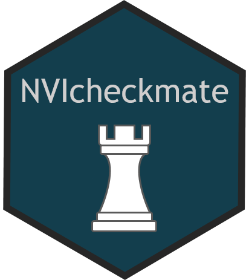

# NVIcheckmate: Extension of checkmate with argument checking adapted for NVIverse 

<!-- README.md is generated from README.Rmd. Please edit that file -->

-   [Overview](#overview)
-   [Installation](#installation)
-   [Usage](#usage)
-   [Copyright and license](#copyright-and-license)
-   [Contributing](#contributing)

# Overview

`NVIcheckmate` extends
[`checkmate`](https://CRAN.R-project.org/package=checkmate) with
functions for argument checking that are adapted for NVIverse.

`NVIcheckmate` is part of `NVIverse`, a collection of R-packages with
tools to facilitate data management and data reporting at the Norwegian
Veterinary Institute (NVI). The `NVIverse` consists of the following
packages: `NVIconfig`, `NVIdb`, `NVIspatial`, `NVIpretty`, `NVIbatch`,
`OKplan`, `OKcheck`, `NVIcheckmate`, `NVIpackager`, `NVIrpackages`. See
[Contribute to
NVIcheckmate](https://github.com/NorwegianVeterinaryInstitute/NVIcheckmate/blob/main/CONTRIBUTING.md)
for more information.

The main purpose of `NVIcheckmate` is to provide checks and assertions
for functions in `NVIverse` in the case that the checks and assertions
are not available in `checkmate`. These include specialized argument
checking as well as checking other requirements like if a package is
installed, if the users credentials are available and, if an valid
ODBC-channel exists.

In addition, an argument for adding a custom message is included in
selected assertions from `checkmate`. Thereby, the error messages for a
specific function may be explained to provide more meaningful error
messages.

`NVIcheckmate` is intended for use together with `checkmate`.
`NVIcheckmate` intend to follow the same principles as `checkmate`
concerning input and error messages. The argument checking in `NVIverse`
uses the assert class in `checkmate` for collecting and reporting the
assertions, and assertions from `checkmate` and `NVIcheckmate` are
combined when checking the arguments of a function.

When and if functionality covered by `NVIcheckmate` are included in
`checkmate` as available at Cran, the corresponding function will be
depreciated and thereafter removed from `NVIcheckmate`.

# Installation

`NVIcheckmate` is available at
[GitHub](https://github.com/NorwegianVeterinaryInstitute). To install
`NVIcheckmate` you will need:

-   R version &gt; 4.0.0
-   R package `remotes`
-   Rtools version 4.0, 4.2 or 4.3 depending on R version

First install and attach the `remotes` package.

    install.packages("remotes")
    library(remotes)

To install (or update) the `NVIcheckmate` package without vignettes, run
the following code:

    remotes::install_github("NorwegianVeterinaryInstitute/NVIcheckmate",
        upgrade = FALSE,
        build = TRUE,
        build_vignettes = FALSE)

To install (or update) the `NVIcheckmate` package with vignettes, you
will need to first install some additional R-packages needed for
creating the vignettes. Check README below in the section
[Vignettes](#vignettes) to see which vignettes are available. To install
the package with the vignettes, first install the packages: `knitr`,
`rmarkdown`, `R.rsp`, and `NVIrpackages` (from GitHub) if they are
missing. Then run the following code:

    remotes::install_github("NorwegianVeterinaryInstitute/NVIcheckmate",
        upgrade = FALSE,
        build = TRUE,
        build_vignettes = TRUE)

# Usage

The `NVIcheckmate` package needs to be attached.

    library(NVIcheckmate)

`NVIcheckmate`extends `checkmate` with functions for argument checking
that are adapted for NVIverse. NVIcheckmate is intended to be used
together with `checkmate`.

#### Further documentation

##### Help

The full list of all available functions and datasets can be accessed by
typing

    help(package = "NVIcheckmate")

##### Vignettes

Consult the vignettes for task-oriented help.

    vignette(package = "NVIcheckmate")

Vignettes in package `NVIcheckmate`:

-   Contribute to NVIcheckmate (html)  
-   NVIcheckmate reference manual (pdf)

##### NEWS

Please check the
[NEWS](https://github.com/NorwegianVeterinaryInstitute/NVIcheckmate/blob/main/NEWS)
for information on new features, bug fixes and other changes.

# Copyright and license

#### NVIcheckmate

Copyright (c) 2021 - 2024 Norwegian Veterinary Institute.  
Licensed under the BSD\_3\_clause License. See
[License](https://github.com/NorwegianVeterinaryInstitute/NVIcheckmate/blob/main/LICENSE)
for details.

Functions and code from `checkmate` have been imported into
`NVIcheckmate`. For some of them, the code have been partly modified. An
overwiew of the functional modifications are given in Table 2. In
addition, some technical changes like escaping character, changing links
and correcting typos have been performed. The modifications are listed
in the respective source files. Code from `checkmate` are the copyright
of the copyright holders of `checkmate`.

#### checkmate

Copyright (c) 2019 - 2022 Michael Lang (michellang@@gmail.com)  
License: BSD 3-Clause

#### Table 2. Functions and code imported from `checkmate`

<table>
<colgroup>
<col style="width: 11%" />
<col style="width: 7%" />
<col style="width: 33%" />
<col style="width: 46%" />
</colgroup>
<thead>
<tr class="header">
<th style="text-align: left;">Function</th>
<th style="text-align: left;">Directory</th>
<th style="text-align: left;">Description</th>
<th style="text-align: left;">Functional modifications</th>
</tr>
</thead>
<tbody>
<tr class="odd">
<td style="text-align: left;">assert.R</td>
<td style="text-align: left;">./R</td>
<td style="text-align: left;">Combines multiple checks into one
assertion</td>
<td style="text-align: left;">Includes the argument ‘comment’</td>
</tr>
<tr class="even">
<td style="text-align: left;">mstopOrPush</td>
<td style="text-align: left;">./R</td>
<td style="text-align: left;">Internal function. Located in file
assert.R</td>
<td style="text-align: left;">None</td>
</tr>
<tr class="odd">
<td style="text-align: left;">mstop</td>
<td style="text-align: left;">./R</td>
<td style="text-align: left;">Internal function. Located in file
helper.R</td>
<td style="text-align: left;">None</td>
</tr>
<tr class="even">
<td style="text-align: left;">makeAssertFunction.R</td>
<td style="text-align: left;">./R</td>
<td style="text-align: left;">Creates an assertion function from a check
function</td>
<td style="text-align: left;">Adds the argument ‘comment’ when creating
an assertion function</td>
</tr>
<tr class="odd">
<td style="text-align: left;">assert_character</td>
<td style="text-align: left;">./R</td>
<td style="text-align: left;">Check if an argument is a vector of type
character</td>
<td style="text-align: left;">Based on checkCharacter and includes the
argument ‘comment’</td>
</tr>
<tr class="even">
<td style="text-align: left;">assert_disjunct</td>
<td style="text-align: left;">./R</td>
<td style="text-align: left;">Check if an argument is a vector of type
character</td>
<td style="text-align: left;">Based on checkDisjunct and includes the
argument ‘comment’</td>
</tr>
<tr class="odd">
<td style="text-align: left;">assert_integer</td>
<td style="text-align: left;">./R</td>
<td style="text-align: left;">Check if an argument is a vector of type
integer</td>
<td style="text-align: left;">Based on checkInteger and includes the
argument ‘comment’</td>
</tr>
<tr class="even">
<td style="text-align: left;">assert_integerish</td>
<td style="text-align: left;">./R</td>
<td style="text-align: left;">Check if an argument is a vector of type
intergish</td>
<td style="text-align: left;">Based on checkIntegerish and includes the
argument ‘comment’</td>
</tr>
<tr class="odd">
<td style="text-align: left;">assert_names</td>
<td style="text-align: left;">./R</td>
<td style="text-align: left;">Perform various checks on character
vectors, usually names</td>
<td style="text-align: left;">Based on checkNames and includes the
argument ‘comment’</td>
</tr>
<tr class="even">
<td style="text-align: left;">assert.R</td>
<td style="text-align: left;">./man-roxygen</td>
<td style="text-align: left;">help template</td>
<td style="text-align: left;">None</td>
</tr>
<tr class="odd">
<td style="text-align: left;">bounds.R</td>
<td style="text-align: left;">./man-roxygen</td>
<td style="text-align: left;">help template</td>
<td style="text-align: left;">None</td>
</tr>
<tr class="even">
<td style="text-align: left;">checker.R</td>
<td style="text-align: left;">./man-roxygen</td>
<td style="text-align: left;">help template</td>
<td style="text-align: left;">Only included information on check_- and
assert_-functions, the rest were removed</td>
</tr>
<tr class="odd">
<td style="text-align: left;">fmatch.R</td>
<td style="text-align: left;">./man-roxygen</td>
<td style="text-align: left;">help template</td>
<td style="text-align: left;">None</td>
</tr>
<tr class="even">
<td style="text-align: left;">makeFunction.R</td>
<td style="text-align: left;">./man-roxygen</td>
<td style="text-align: left;">help template</td>
<td style="text-align: left;">None</td>
</tr>
<tr class="odd">
<td style="text-align: left;">na-handling.R</td>
<td style="text-align: left;">./man-roxygen</td>
<td style="text-align: left;">help template</td>
<td style="text-align: left;">None</td>
</tr>
<tr class="even">
<td style="text-align: left;">null.ok.R</td>
<td style="text-align: left;">./man-roxygen</td>
<td style="text-align: left;">help template</td>
<td style="text-align: left;">None</td>
</tr>
<tr class="odd">
<td style="text-align: left;">sorted.R</td>
<td style="text-align: left;">./man-roxygen</td>
<td style="text-align: left;">help template</td>
<td style="text-align: left;">None</td>
</tr>
<tr class="even">
<td style="text-align: left;">typed.missing.R</td>
<td style="text-align: left;">./man-roxygen</td>
<td style="text-align: left;">help template</td>
<td style="text-align: left;">None</td>
</tr>
<tr class="odd">
<td style="text-align: left;">x.R</td>
<td style="text-align: left;">./man-roxygen</td>
<td style="text-align: left;">help template</td>
<td style="text-align: left;">None</td>
</tr>
</tbody>
</table>

# Contributing

Contributions to develop `NVIcheckmate` is highly appreciated. There are
several ways you can contribute to this project: ask a question, propose
an idea, report a bug, improve the documentation, or contribute code.
See [Contribute to
NVIcheckmate](https://github.com/NorwegianVeterinaryInstitute/NVIcheckmate/blob/main/CONTRIBUTING.md)
for more information.

## <!-- Code of conduct -->

Please note that the NVIcheckmate project is released with a
[Contributor Code of
Conduct](https://github.com/NorwegianVeterinaryInstitute/NVIcheckmate/blob/main/CODE_OF_CONDUCT.md).
By contributing to this project, you agree to abide by its terms.
